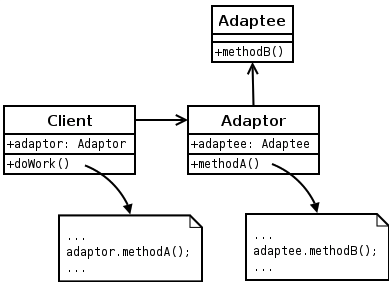

## 어댑터 패턴(Adapter Pattern)

* 어댑터 패턴을 이용하면 호환성 문제때문에 같이 쓸수 없는 클래스들을 연결해서 사용 할 수 있다.
* 기존에 있던 모델에 호환성이 문제가 되어서 고칠수 없으니까 어댑터를 만들어서 연결을 한다.

```swift
class UserDB {
    var email: String
    var name: String
    var profileURLPath: String
    var age: Int

    init(email: String, name: String, profileURLPath: String, age: Int) {
        self.email = email
        self.name = name
        self.profileURLPath = profileURLPath
        self.age = age
    }
}

class Profile {
    var thumbnailURLPath: String
    var lowQualityImageURLPath: String
    var highQualityImageURLPath: String

    init(thumbnailURLPath: String, lowQualityImageURLPath: String, highQualityImageURLPath: String) {
        self.thumbnailURLPath = thumbnailURLPath
        self.lowQualityImageURLPath = lowQualityImageURLPath
        self.highQualityImageURLPath = highQualityImageURLPath
    }
}

class User {
    var email: String
    var name: String
    var profile: Profile
    var age: Int

    init(email: String, name: String, profile: Profile, age: Int) {
        self.email = email
        self.name = name
        self.profile = profile
        self.age = age
    }
}

class UserAdapter {
    var user: UserDB

    var email: String {
        return self.user.email
    }

    var name: String {
        return self.user.name
    }

    var profile: Profile {
        return Profile(thumbnailURLPath: self.user.profileURLPath, lowQualityImageURLPath: self.user.profileURLPath, highQualityImageURLPath: self.user.profileURLPath)
    }

    var age: Int {
        return self.user.age
    }

    init(user: UserDB) {
        self.user = user
    }
}


let user = UserDB(email: "email", name: "name", profileURLPath: "http://profile.png", age: 30)
let userAdapter = UserAdapter(user: user)
print(userAdapter.email)
print(userAdapter.name)
print(userAdapter.profile)
print(userAdapter.age)
```


