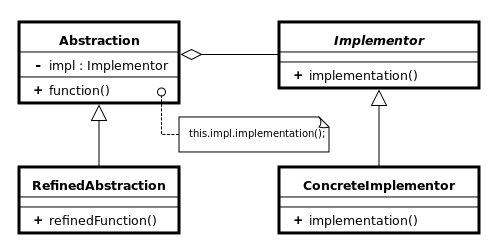

## 브릿지 패턴 (Bridge Pattern)

* 구현부에서 추상층을 분리하여 각자 독립적으로 변형이 가능하고 확장이 가능하도록 한다.
* 기능과 구현에 대해 별도로 클래스를 구현한다.
* 추상화를 수정하지 않고 구현 세부 사항을 대체하는 수단을 제공하는 데 사용된다.
* 내부 구현과 인터페이스를 나누면 변경되는 범위가 작아진다는 장점이 있고 구현부분을 숨길수 있다.

```swift
protocol ShapeAnimation {
    func draw()
    func animation()
    func remove()
}

class ShapeMoveAnimation: ShapeAnimation {
    func draw() {
        print("도형을 그립니다.")
    }

    func animation() {
        print("도형의 위치를 옮깁니다.")
    }

    func remove() {
        print("도형을 지웁니다.")
    }
}

class ShapeScaleAnimation: ShapeAnimation {
    func draw() {
        print("도형을 그립니다.")
    }

    func animation() {
        print("도형을 확대합니다.")
    }

    func remove() {
        print("도형을 지웁니다.")
    }
}

class Shape {
    var shapeAnimation: ShapeAnimation

    init(shapeAnimation: ShapeAnimation) {
        self.shapeAnimation = shapeAnimation
    }

    func animation() {
        print("도형 애니메이션을 시작합니다.")
        shapeAnimation.draw()
        shapeAnimation.animation()
        shapeAnimation.remove()
    }
}

var moveShape = Shape(shapeAnimation: ShapeMoveAnimation())
moveShape.animation()

var scaleShape = Shape(shapeAnimation: ShapeScaleAnimation())
scaleShape.animation()
```


