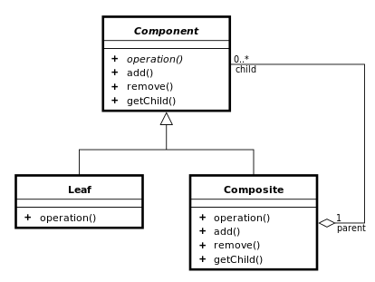

## 컴퍼지트

* 객체와 객체의 그룹을 구분없이 하나의 인터페이스로 다룰수 있게 한다.
* 객체와 구성을 트리로 구성하여 하나의 인터페이스에서 사용하도록 고려한 패턴이다.
* 단일체와 복합체를 하나의 인터페이스로 만들수 있다.
* 폴더와 디렉터리 관계의 예제가 자주 나온다.
* 조직도나 가족 관계로도 예를 들수 있게 된다.

```swift
protocol Component {
    var name: String { set get }
    var path: String { set get }
}

class File: Component {
    var name: String
    var path: String
    var ext: String? {
        if self.name.contains(".") {
            return self.name.components(separatedBy: ".").last
        } else {
            return nil
        }
    }

    init(name: String, path: String) {
        self.name = name
        self.path = path
    }
}

class File: Component {
    var name: String
    var path: String

    var ext: String? {
        if self.name.contains(".") {
            return self.name.components(separatedBy: ".").last
        } else {
            return nil
        }
    }

	  var isDirectory : Bool {
			return children.isEmpty ? false : true
	  }

    var children = [Component]()

    init(name: String, path: String) {
        self.name = name
        self.path = path
    }

    func add(_ component: Component) {
        self.children.append(component)
    }

    func remove(_ component: Component) {
        for (index, element) in self.children.enumerated() {
            if element.name == component.name && element.path == component.path {
                self.children.remove(at: index)
                break
            }
        }
    }
}
```


