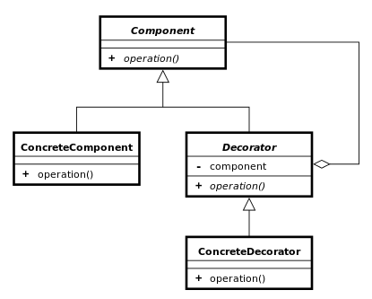

## 데커레이터

* 어떤 기능에 추가적으로 기능을 덧붙이고 싶은 경우 기능들을 데코레이터로 만들어서 덧붙이는 방식
* 많은 기능들이 있을때 모든 조합을 만들기는 힘들다. 대코레이터패턴으로 하면 모든 조합을 만들필요가 없다.

```swift
enum Tool {
    case bold
    case font
    case align
    case image
    case video
    case calendar
}

protocol Editor {
    var description: String { get }
    var tools: [Tool] { get }
    func upload()
}

class TextEditor: Editor {
    var description: String {
        return "텍스트 에디터"
    }

    var tools: [Tool] {
        return [.bold, .font, .align]
    }

    func upload() {
        print("에디터 업로드")
    }
}

protocol Decorator {
    var name: String { get }
    var tool: Tool { get }
}

class ImageDecorator: Decorator {
    var name: String {
        return "이미지"
    }

    var tool: Tool {
        return .image
    }
}

class VideoDecorator: Decorator {
    var name: String {
        return "비디오"
    }

    var tool: Tool {
        return .video
    }
}

class CalendarDecorator: Decorator {
    var name: String {
        return "캘린더"
    }

    var tool: Tool {
        return .calendar
    }
}

class CustomEditor: Editor {
    var editor: Editor
    var decorator: Decorator

    init(editor: Editor, decorator: Decorator) {
        self.editor = editor
        self.decorator = decorator
    }

    var description: String {
        return self.decorator.name + " " + self.editor.description
    }

    var tools: [Tool] {
        var editorTools = self.editor.tools
        editorTools.append(self.decorator.tool)
        return editorTools
    }

    func upload() {
        self.editor.upload()
    }
}

let imageEditor = CustomEditor(editor: TextEditor(), decorator: ImageDecorator())
let videoEditor = CustomEditor(editor: TextEditor(), decorator: VideoDecorator())
let imageCalendarEditor = CustomEditor(editor: imageEditor, decorator: CalendarDecorator())
let videoCalendarEditor = CustomEditor(editor: videoEditor, decorator: CalendarDecorator())

print(imageEditor.description)
print(videoEditor.description)
print(imageCalendarEditor.description)
print(videoCalendarEditor.description)
```


