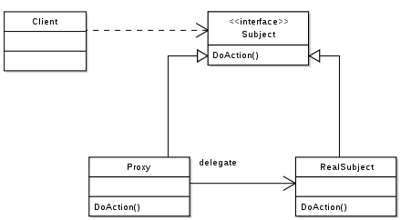

## 프록시(Proxy)

* 실제 객체를 대신하는 대리자 역활을 한다.
* 프록시에게 어떤 일을 대신 시킨다.
* 클라이언트는 프록시를 호출하고 프록시는 실제 객체를 호출한다.

```swift
protocol Subject {
    func doAction()
}

class RealSubject: Subject {
    func doAction() {
        print("액션을 합니다.")
    }
}

class Proxy: Subject {
    private var subject: Subject

    init() {
        self.subject = RealSubject()
    }

    func doAction() {
        self.subject.doAction()
    }
}

let proxy = Proxy()
proxy.doAction()
```


[Effective Programming :: Proxy 패턴과 그 활용](https://effectiveprogramming.tistory.com/entry/Proxy-%ED%8C%A8%ED%84%B4%EA%B3%BC-%EA%B7%B8-%ED%99%9C%EC%9A%A9) 참고

### 동적 생성 프록시

* 프록시가 실제 객체를 생성하지 않고 실제 요청시 실제 객체를 생성한다.
* 실제 객체의 생성에 많은 자원이 소모되지만 요청 빈도가 낮을때 사용된다.

```swift
class Proxy: Subject {
    private var subject: Subject?

    init() {

    }

    func doAction() {
        if self.subject == nil {
            self.subject = RealSubject()
        }
        self.subject?.doAction()
    }
}
```

### 가상 프록시

* 실제 객체가 존재하지 않을때 사용한다. 협업을 할때 인터페이스는 정의되어 있으나 실제 구현은 되어 있지 않을때 가상 프록시를 이용한다.

```swift
class Proxy: Subject {
    init() {

    }

    func doAction() {

    }
}
```

### AOP(Aspect Oriented Programming)프록시

* 관점 지향 프로그래밍
* AOP는 애플리케이션 전체에 걸쳐 사용되는 기능을 재사용 하도록 지원하는 것이다.
* 모든 객체에 공통으로 적용되는 기능들을 구현하는 개발방법을 말한다.
* 예를들어 애널리틱스 로그를 찍거나 시간을 측정하거나 트랜젝션 작업 등의 경우에 사용한다.

```swift
class Proxy: Subject {
    private var subject: Subject

    init() {
        self.subject = RealSubject()
    }

    func doAction() {
        self.preProcess()
        self.subject.doAction()
        self.postProcess()
    }

    private func preProcess() {
        print("작업 시작")
    }

    private func postProcess() {
        print("작업 끝")
    }
}
```

### 자원 관리 프록시

* 실제 객체가 비용이 큰 자원에 대한 생성을 담당할때 쓴다.

### 원격 프록시

* 프록시가 원격에 있는 객체처럼 동작하도록 한다.


