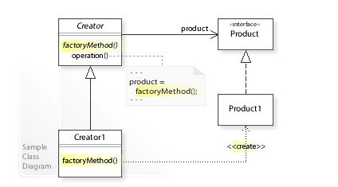

## 팩토리 메서드

* 공통된 화면, 중복된 기능을 인터페이스로 청사진을 만들고 팩토리에서 객체를 생성해서 반환하는 패턴
* 공통된 화면의 추가 삭제가  편하다
* 생성된 클래스가 런타임시에 결정된다.
* NSNumber 가 팩토리 메서드로 되어있다

```swift
protocol KeypadDelegate: class {
   func keypadText(_ text: String?)
   func keypadCall()
}

class KeypadButton: UIButton {
   weak var delegate: KeypadDelegate?

   init() {
       super.init(frame: CGRect(x: 0, y: 0, width: 60, height: 60))
       self.layer.cornerRadius = 30

       self.addTarget(self, action: #selector(self.touchTap(_:)), for: .touchUpInside)
   }

   required init?(coder aDecoder: NSCoder) {
       fatalError("init(coder:) has not been implemented")
   }

   @objc func touchTap(_ sender: UIButton) {

   }
}

class CallKeypadButton: KeypadButton {

   override init() {
       super.init()
   }

   required init?(coder aDecoder: NSCoder) {
       fatalError("init(coder:) has not been implemented")
   }

   override func touchTap(_ sender: UIButton) {
       self.delegate?.keypadCall()
   }
}

class NumberKeypadButton: KeypadButton {
   private let numberLabel: UILabel = {
       let label = UILabel()
       return label
   }()

   private let textLabel: UILabel = {
       let label = UILabel()
       return label
   }()

   init(number: String, text: String?) {
       super.init()

       self.numberLabel.text = number
       self.textLabel.text = text
   }

   required init?(coder aDecoder: NSCoder) {
       fatalError("init(coder:) has not been implemented")
   }

   override func touchTap(_ sender: UIButton) {
       self.delegate?.keypadText(self.numberLabel.text)
   }
}

class SymbolKeypadButton: KeypadButton {
   private let symbolLabel: UILabel = {
       let label = UILabel()
       return label
   }()

   init(symbol: String) {
       super.init()

       self.symbolLabel.text = symbol
   }

   required init?(coder aDecoder: NSCoder) {
       fatalError("init(coder:) has not been implemented")
   }

   override func touchTap(_ sender: UIButton) {
       self.delegate?.keypadText(self.symbolLabel.text)
   }
}

enum KeypadButtonFactory {
   enum KeypadType {
       case call
       case number(number: String, text: String?)
       case symbol(symbol: String)
   }

   static func create(type: KeypadType) -> KeypadButton {
       switch type {
       case .call:
           return CallKeypadButton()
       case .number(let number, let text):
           return NumberKeypadButton(number: number, text: text)
       case .symbol(let symbol):
           return SymbolKeypadButton(symbol: symbol)
       }
   }

}

let callButton = KeypadButtonFactory.create(type: .call)
let oneButton = KeypadButtonFactory.create(type: .number(number: "1", text: nil))
let twoButton = KeypadButtonFactory.create(type: .number(number: "2", text: "A B C"))
```


