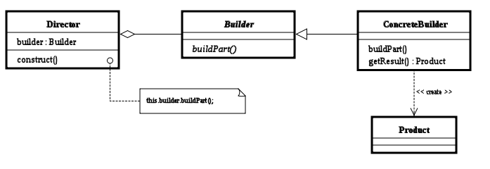

## 빌더

* 객체 생성을 깔끔하고 유연하게 만들 수 있다.

### 선생성 - 클로져

```swift
class DatePickerBuilder {
    var datePickerMode: UIDatePicker.Mode = .date
    var minimumDate: Date?
    var maximumDate: Date?
    var date: Date?

    typealias BuilderClosure = (DatePickerBuilder) -> ()

    init(buildClosure: BuilderClosure) {
        buildClosure(self)
    }
}

class DatePicker: UIDatePicker {

    init(builder: DatePickerBuilder) {
        super.init(frame: CGRect(x: 0, y: 0, width: UIScreen.main.bounds.width, height: 300))
        self.minimumDate = builder.minimumDate
        self.maximumDate = builder.maximumDate
        self.datePickerMode = builder.datePickerMode
        if let date = builder.date {
            self.setDate(date, animated: false)
        }
    }

    required init?(coder aDecoder: NSCoder) {
        fatalError("init(coder:) has not been implemented")
    }
}

let datePickerBuilder = DatePickerBuilder { (builder) in
    builder.maximumDate = Date()
    builder.date = Date()
}

let datePicker = DatePicker(builder: datePickerBuilder)
```

### 후생성 - 메서드 체이닝


