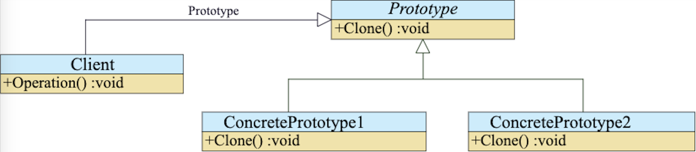

## 프로토타입

* 미리 만들어진 객체(object) 를 복사하여 객체를 만든다
* 다수의 객체 생성시에 발생되는 객체 생성 비용을 효과적으로 줄일수 있다
* clone메서드로 자신과 같은 새로운 객체를 반환 한다

```swift
class Paragraph {
    var font: UIFont
    var color: UIColor
    var text: String

    init(font: UIFont, color: UIColor, text: String) {
        self.font = font
        self.color = color
        self.text = text
    }

    func clone() -> Paragraph {
        return Paragraph(font: self.font, color: self.color, text: self.text)
    }
}

let base = Paragraph(font: .systemFont(ofSize: 15), color: .black, text: "Hello")

let title = base.clone()
title.font = UIFont.boldSystemFont(ofSize: 20)
title.text = "This is title"

let body = base.clone()
body.text = "This is body"
```


NSObject를 상속 받으면 copy라는 메서드가 있다.

[copy() - NSObject | Apple Developer Documentation](https://developer.apple.com/documentation/objectivec/nsobject/1418807-copy)

하지만 클라이언트에서 copy메서드를 사용하였을때 copy를 구현하지 안았으면
**NSInvalidArgumentException** 에러가 나온다.


```swift
class Paragraph: NSObject {
    var font: UIFont
    var color: UIColor
    var text: String

    init(font: UIFont, color: UIColor, text: String) {
        self.font = font
        self.color = color
        self.text = text
    }

    override func copy() -> Any {
        return Paragraph(font: self.font, color: self.color, text: self.text)
    }
}
```


NSCopying 프로토콜 채택하게 되면 copy메서드는 required로 선언되어 있고 필수로 적어줘야 한다.

[copy(with:) - NSCopying | Apple Developer Documentation](https://developer.apple.com/documentation/foundation/nscopying/1410311-copy)

```swift
class Paragraph: NSObject, NSCopying {
    var font: UIFont
    var color: UIColor
    var text: String

    init(font: UIFont, color: UIColor, text: String) {
        self.font = font
        self.color = color
        self.text = text
    }

    func copy(with zone: NSZone? = nil) -> Any {
        return Paragraph(font: self.font, color: self.color, text: self.text)
    }
}
```


간단한 예제를 보면

```swift
class MyViewController : UIViewController {

    @IBOutlet private weak var openButton: UIButton!

    private var openBarButtonItem: UIBarButtonItem = {
        let button = UIButton(type: .system)
        button.setTitle("열기", for: .normal)
        button.setTitleColor(.white, for: .normal)
        button.backgroundColor = UIColor.blue
        let barButtonItem = UIBarButtonItem(customView: button)
        return barButtonItem
    }()

    override func viewDidLoad() {
        super.viewDidLoad()

        self.openButton.setTitle("열기", for: .normal)
        self.openButton.setTitleColor(.white, for: .normal)
        self.openButton.backgroundColor = UIColor.blue
        self.navigationItem.rightBarButtonItem = self.openBarButtonItem
    }
}
```

열기 UIButton과 열기 UIBarButtonItem이 같은 디자인이였을때 같은 디자인을 두번 만들어줘야 한다.

프로토타입 패턴을 사용하면 아래와 같이 변경할수 있다.

```swift
extension UIButton {
    func clone() -> UIButton{
        let button = UIButton(type: self.buttonType)
        button.setTitle(self.currentTitle, for: .normal)
        button.setTitleColor(self.titleColor(for: .normal), for: .normal)
        button.backgroundColor = self.backgroundColor
        return button
    }
}

class MyViewController : UIViewController {

    @IBOutlet private weak var openButton: UIButton!

    private lazy var openBarButtonItem: UIBarButtonItem = {
        let barButtonItem = UIBarButtonItem(customView: self.openButton.clone())
        return barButtonItem
    }()

    override func viewDidLoad() {
        super.viewDidLoad()

        self.openButton.setTitle("열기", for: .normal)
        self.openButton.setTitleColor(.white, for: .normal)
        self.openButton.backgroundColor = UIColor.blue
        self.navigationItem.rightBarButtonItem = self.openBarButtonItem
    }
}
```


