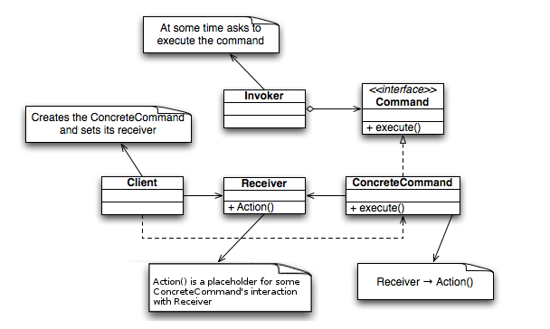

## 커맨드

* 요청을 객체의 형태로 캡슐화 할수 있고 매개변수를 써서 여러가지 다른 요구사항을 넣을수 있다.
* 요청내역을 큐에 저장하거나 로그기록, 작업취소 기능도 추가할수 있다.
* 요청과 수행에 있어서 분리하여 느슨한 관계를 가진다.

```swift
class Lamp {
    var isOn = false

    func on() {
        self.isOn = true
        print("\(self) 램프 on")
    }

    func off() {
        self.isOn = false
        print("\(self) 램프 off")
    }
}

class Alarm {
    var isStart = false

    func start() {
        self.isStart = true
        print("\(self) 알림 start")
    }

    func stop() {
        self.isStart = false
        print("\(self) 알림 stop")
    }
}

protocol Command {
    func excute()
}

class LampOnCommand: Command {
    var lamp: Lamp

    init(lamp: Lamp) {
        self.lamp = lamp
    }

    func excute() {
        self.lamp.on()
    }
}

class LampOffCommand: Command {
    var lamp: Lamp

    init(lamp: Lamp) {
        self.lamp = lamp
    }

    func excute() {
        self.lamp.off()
    }
}

class AlarmStartCommand: Command {
    var alarm: Alarm

    init(alarm: Alarm) {
        self.alarm = alarm
    }

    func excute() {
        self.alarm.start()
    }
}

class AlarmStopCommand: Command {
    var alarm: Alarm

    init(alarm: Alarm) {
        self.alarm = alarm
    }

    func excute() {
        self.alarm.stop()
    }
}

class RemoteControl {
    var slot: Command?

    func pressedButton() {
        self.slot?.excute()
    }
}

let remote = RemoteControl()
let lamp = Lamp()
let alarm = Alarm()

let onLamp = LampOnCommand(lamp: lamp)
let offLamp = LampOffCommand(lamp: lamp)
let startAlarm = AlarmStartCommand(alarm: alarm)
let stopAlarm = AlarmStopCommand(alarm: alarm)

remote.slot = onLamp
remote.pressedButton()

remote.slot = offLamp
remote.pressedButton()

remote.slot = startAlarm
remote.pressedButton()

remote.slot = stopAlarm
remote.pressedButton()
```

한번에 여러 명령어를 수행하도록 확장해서 사용할수도 있다.

```swift
class RemoteControl {
    var slots = [Command]()

    func pressedButton() {
        self.slots.forEach({ $0.excute() })
    }
}

var remote = RemoteControl()
let lamp = Lamp()
let alarm = Alarm()

let onLamp = LampOnCommand(lamp: lamp)
let offLamp = LampOffCommand(lamp: lamp)
let startAlarm = AlarmStartCommand(alarm: alarm)
let stopAlarm = AlarmStopCommand(alarm: alarm)

remote.slots = [onLamp, startAlarm]
remote.pressedButton()

remote.slots = [offLamp, stopAlarm]
remote.pressedButton()
```


